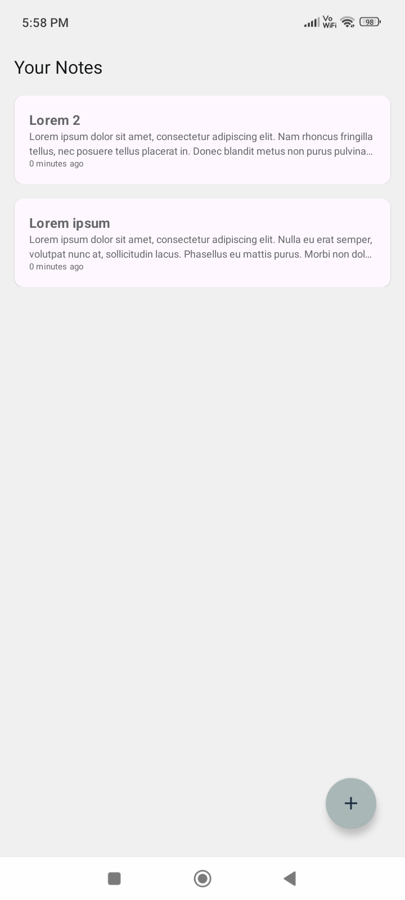
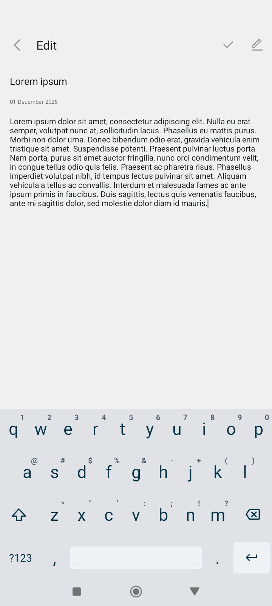

# Uno-Pad
## 📌 Description

UnoPad is a simple and lightweight note-taking application built with **Kotlin**, **Coroutines**, and **Room Database**.  
It provides a smooth and responsive experience for creating and managing notes.

## ✨ Features

- ➕ Add new notes easily  
- 📝 Edit existing notes  
- ✏️ Modify and update notes quickly  
- 💾 Local storage using Room Database  
- ⚡ Fast and efficient operations powered by Kotlin Coroutines

### Screenshot

## ⚠️ Warning

Use **UnoPad** at your own risk.

This application is provided *as is* and is intended **only for personal use**.  
**Do not use UnoPad for professional, commercial, or critical purposes.**

The developers/contributors are not responsible for any data loss, inaccuracies, or any issues that may arise from using this software.

